# Pràctica Tema 4 - Configuració de Moodle - AitorH

## 1. Administració del perfil d'usuari
### 1.1 <ins>Canviar direcció de correu electrònic i contrasenya.</ins>
 - Accediu a **"Perfil"** o **"Profile"**
 
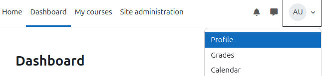

 - Accediu a **"Editar Perfil"** o **"Edit Profile"**
 
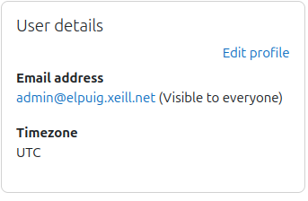

 - Canvieu la vostra contraseña o correu als apartats:
   - **"New Password"** o **"Nova Contraseña"**
   - **"Email Address"** o **"Direcció de Email"**

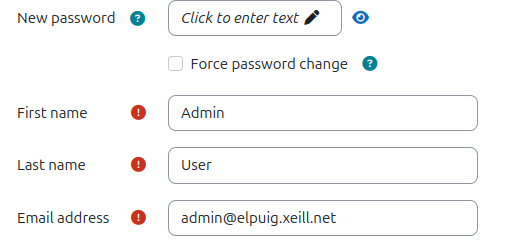

### 1.2 <ins>Afegir un avatar al vostre perfil.</ins>

 - En el mateix apartat de **"Editar Perfil"** o **"Edit Profile"**, neu a la part baixa, on posa **"User Picture"** o **"Imatge d'Usuari"**. Clickeu al "+" per afegir la vostre imatge que voleu que us representi.

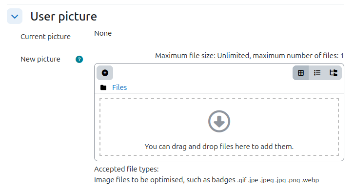

## 2. Configuració del lloc
### 2.1 <ins>Canviar el nom del teu moodle</ins>
- Canvia el nom del lloc (tant llarg com curt) i feu que la pàgina principal no mostri contingut per als usuaris no autenticats:
  - Accediu a **"Administració del lloc"** o **"Site administrator"**

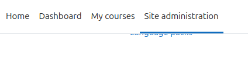
    
  - A la part baixa en l'apartat **"Site Home"** o **"Pàgina d'inici del lloc"**
  - Accediu a **"Paràmetres de la pàgina d'inici"** o **"Site home settings"**

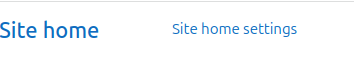

  - En aquesta part, pots editar el teu lloc i canviar el nom
     
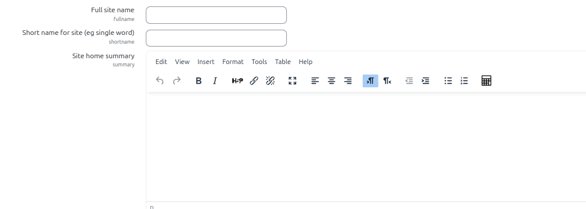

### 2.2 <ins>Canviar els permisos del teu moodle</ins>

  - Més abaix, s'editan els permisos, aqui caig canviar el primer que posava en **"Site Home"** a **"None"**, aixó per a que les comptes que no estiguesin registrades al curs, no poguin veure els cursos de la meva página de moodle.
     
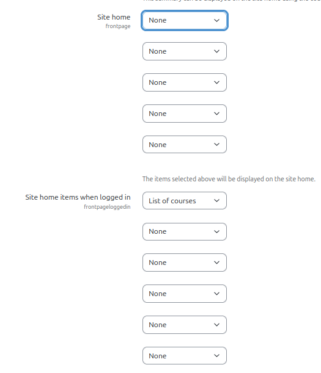

### 2.3 <ins>Canviar l'ubicació del teu moodle</ins>
  - Accediu a **"Administració del lloc"** o **"Site administrator"**
  - Accediu a **"Paràmetres de ubicació** o **"Location settings"**

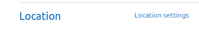

  - Canvia elm temps de la zona a el teu lloc a **"Default timezone"**

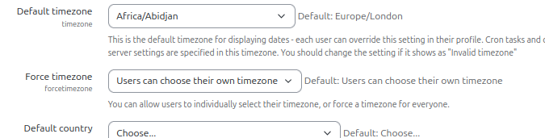

### 2.4 <ins>Canviar l'idioma del teu moodle</ins>
  - Accediu a **"Administració del lloc"** o **"Site administrator"**
  - Accediu a **"Paràmetres de idioma** o **"Language settings"**
    
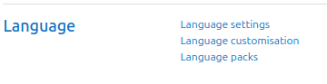

  - Canvia l'idioma del teu lloc a **"Default language"** o **"Idioma Predeterminat"**

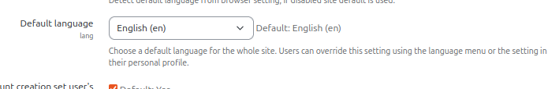

### 2.5 <ins>Canviar la normativa del teu moodle</ins>
  - Accediu a **"Administració del lloc"** o **"Site administrator"**
  - Accediu a **"Paràmetres del Seguretat** o **"Site Security settings"**
    
  - Més abaix podeu canviar els parámetres de la contraseña per entrar l teu nlloc
  - imagen 14

## 3. Creació de cursos

### 3.1 Crear el curs A (3 temes)  

Ves a la página d'inici, ves a **"Els meus cursos"** o **"My courses"**
   - Donali a **"Afegeix curs"** o **"Create new course"**  
   

Configuració del lloc :
   - **Nom complet del curs / Course full name:** `A`
   - **Nom curt / Course short name:** `A`
   - **Format del curs / Course format:** `Format per temes / Topics format`
   - **Nombre de seccions / Number of sections:** `3`

Clica **Desa i visualitza / Save and display**.

### 3.2 Crear el curs B (5 temes)

2. Canvia:
   - **Nom complet / Full name:** `B`
   - **Nombre de seccions / Sections:** `5`
3. Desa.

### 3.3 Personalització dels cursos / Course Customization

#### 3.3.1 Activar mode edició / Turn editing on

1. Entra al curs.
2. Clica:  
   **Activa edició / Turn editing on**  
   

#### 3.3.2 Afegir un PDF / Add a PDF file

1. Amb edició activada.
2. Clica:  
   **Afegeix una activitat o recurs / Add an activity or resource**
3. Tria:  
   **Fitxer / File**  
   
4. Posa un nom i puja el PDF.
5. Desa.

#### 3.3.3 Canviar títol d’un tema / Rename a topic

1. Clica **Edita / Edit** al costat del títol.
2. Tria **Edita secció / Edit topic**.  
   
3. Canvia el nom.
4. Desa.

## 4. Usuaris / Users

### 4.1 Crear usuari manual (Bob)  

1. Ves a:  
   **Administració del lloc → Usuaris → Comptes → Afegeix un usuari**  
   **Site administration → Users → Accounts → Add a new user**  
   

2. Omple:
   - **Nom d’usuari / Username:** `bob`
   - **Nom / First name:** Bob
   - **Autenticació / Authentication:** Manual

3. Desa

## 5. Matriculació d’usuaris / User Enrolment

### 5.1 Configuració de mètodes d’inscripció

#### 5.1.1 Curs A – Accés públic

1. Entra al curs A i activa el mode Editor

2. Ves a:  
   **Participants**  
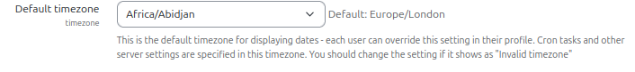

4.  Ves a:  
   **Enrolled users** i ves a **"Enrolment methods"**
    
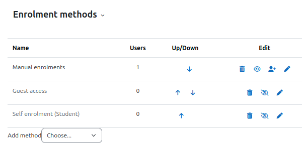

5. Edita els Accesos amb el ull, fes-ho tot visible
     
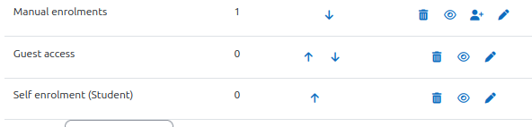

#### 5.1.2 Curs B – Inscripció manual

1. Entra al curs B i activa el mode Editor

2. Ves a:  
   **Participants**  
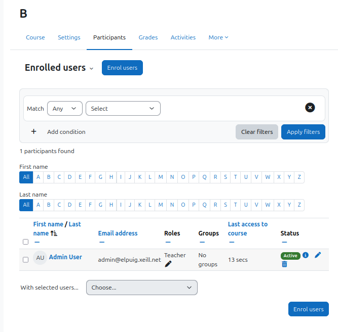
3.  Ves a:  
   **Enrolled users** i ves a **"Enrolment methods"**
4. Edita els Accesos amb el ull, fes-ho tot visible  
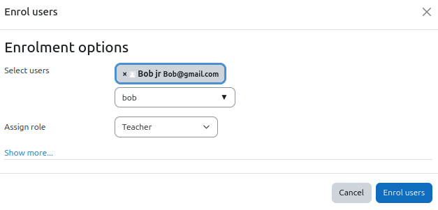

---

### 5.2 Verificació / Verification

- **Curs A** → accessible sense iniciar sessió.  
  **Course A** → accessible without login.

- **Curs B** → requereix iniciar sessió.  
  **Course B** → requires login.

---

## 6. Personalització del lloc

### 6.1 Instal·lar un tema

1. Ves a:  
   **Administració del lloc → Connectors → Instal·lar complement**  
   **Site administration → Plugins → Install plugins**  

2. Pujar el fitxer ZIP del tema.  
   **Upload the theme ZIP.**

3. Completa la instal·lació.  
   **Finish installation.**

---

### 6.2 Seleccionar el tema / Select the Theme

1. Ves a:  
   **Aparença → Selector de temes**  
   **Appearance → Theme selector**  
   

2. Tria el tema instal·lat.  
   **Choose the installed theme.**

---

### 6.3 Editar capçalera, peu i portada  
/Edit Header, Footer and Front Page

1. Ves a:  
   **Aparença → Temes → [Nom del tema]**  
   **Appearance → Themes → [Theme name]**  
   

2. Edita:  
   - **Capçalera / Header**  
   - **Peu / Footer**  
   - **Pàgina principal / Front page**

3. Desa els canvis.  
   **Save changes.**

---

### 6.4 Afegir logotip / Add Logo

1. Ves a:  
   **Aparença → Logotip / Appearance → Logos**

2. Pujar imatge.  
   **Upload image.**

---

## 7. Creació de continguts i activitats / Content & Activities

### 7.1 Curs A

#### Assignar professor i alumnes / Assign Teacher and Students

1. Ves a:  
   **Usuaris inscrits / Enrolled users**
2. Assigna rols.  
   **Assign roles.**

---

#### Afegir activitats i recursos / Add Activities and Resources

1. **Activa edició / Turn editing on**
2. Afegeix:  
   - Fitxer / File  
   - URL  
   - Llibre / Book  
   - Fòrum / Forum  
   - Qüestionari / Quiz  
   - Tasca / Assignment  

---

#### Crear una tasca amb entrega PDF  
/Create an Assignment Requiring PDF Upload

1. **Afegeix activitat → Tasca**  
   **Add activity → Assignment**

2. Configura:  
   - **Tipus d’entrega / Submission types:** Fitxers / Files  
   - **Tipus acceptats / Accepted types:** `.pdf`  
   - **Data d’entrega / Due date:** oberta / open

3. Desa.  
   **Save.**

---

## 7.2 Curs B – Importar contingut del curs A  
/Course B – Import Content from Course A

1. Entra al curs B.  
   **Enter Course B.**

2. Ves a:  
   **Administració del curs → Importa**  
   **Course administration → Import**

3. Selecciona el curs A.  
   **Select Course A.**

4. Tria què vols importar.  
   **Choose what to import.**

5. Confirma.  
   **Confirm.**

---

# 8. Qualificacions i insígnies / Grades & Badges

## 8.1 Qualificacions / Grades

1. Completa activitats com alumne.  
   **Complete activities as a student.**

2. Ves a:  
   **Configuració del qualificador / Gradebook setup**

3. Configura el càlcul automàtic.  
   **Configure automatic grading.**

---

## 8.2 Insígnies / Badges

1. Ves a:  
   **Administració del lloc → Insígnies**  
   **Site administration → Badges**

2. Crea una nova insígnia.  
   **Create a new badge.**

3. Defineix criteris.  
   **Define criteria.**

4. Atorga-la a un alumne.  
   **Award it to a student.**

---

# 9. Qüestionaris / Quizzes

## Crear qüestionari / Create Quiz

1. **Afegeix activitat → Qüestionari**  
   **Add activity → Quiz**

---

## Afegir preguntes del banc / Add Questions from Question Bank

1. Ves a:  
   **Banc de preguntes / Question bank**

2. Crea categories.  
   **Create categories.**

3. Afegeix preguntes.  
   **Add questions.**

4. Ves a:  
   **Edita qüestionari / Edit quiz → Add from question bank**

---

## Verificació / Verification

- Alumne respon el qüestionari.  
  **Student answers the quiz.**

- Professor revisa qualificacions.  
  **Teacher checks grades.**

---

# 10. Importació i exportació de cursos / Course Import & Export

## Exportar còpia de seguretat / Export Backup

1. Ves a:  
   **Administració del curs → Còpia de seguretat**  
   **Course administration → Backup**

2. Segueix l’assistent.  
   **Follow the wizard.**

3. Descarrega el fitxer.  
   **Download the file.**

---

## Importar curs / Import Course

1. Ves a:  
   **Administració del curs → Restaura**  
   **Course administration → Restore**

2. Pujar el fitxer del company.  
   **Upload colleague’s file.**

3. Segueix l’assistent.  
   **Follow the wizard.**

---

# 11. Seguretat / Security

## Bloquejar una IP / Block an IP

1. Ves a:  
   **Administració del lloc → Seguretat → Bloqueig IP**  
   **Site administration → Security → IP blocker**

2. Afegeix la IP a la llista negra.  
   **Add the IP to the blacklist.**

---

## Polítiques de seguretat / Security Policies

1. Ves a:  
   **Seguretat → Polítiques del lloc**  
   **Security → Site policies**

2. Activa:  
   - Contrasenyes fortes / Strong passwords  
   - Temps de sessió / Session timeout  
   - Bloqueig d’intents fallits / Failed login lockout  
